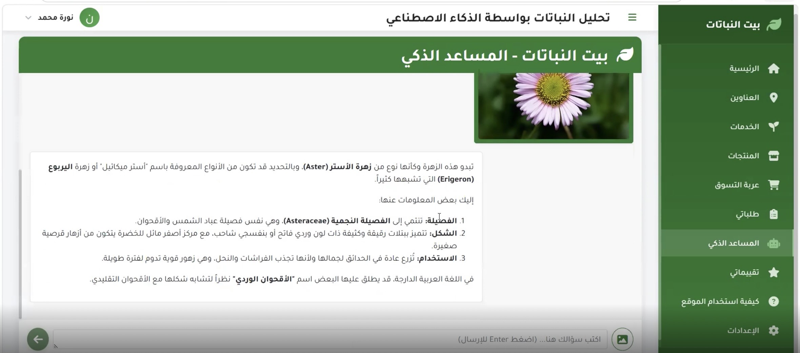
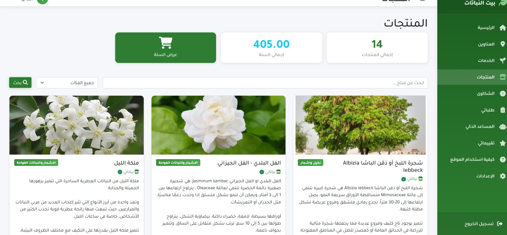
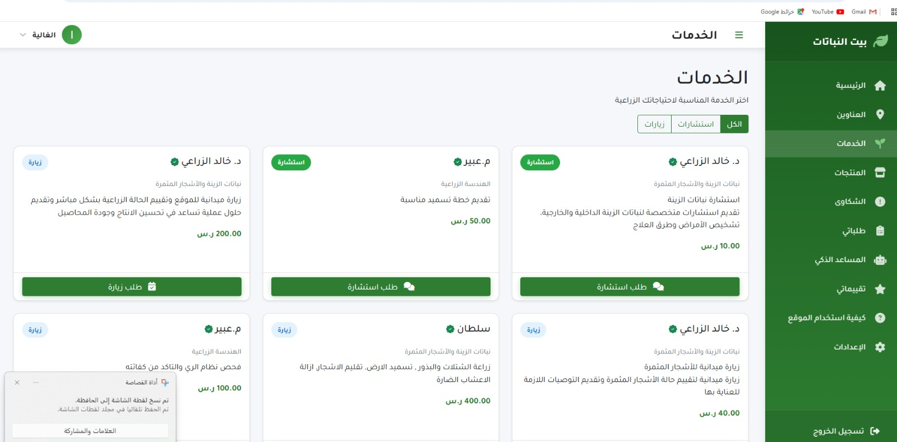
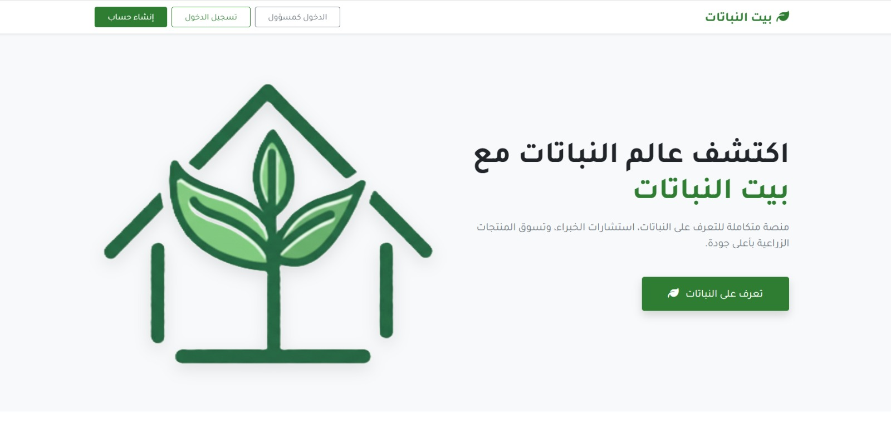
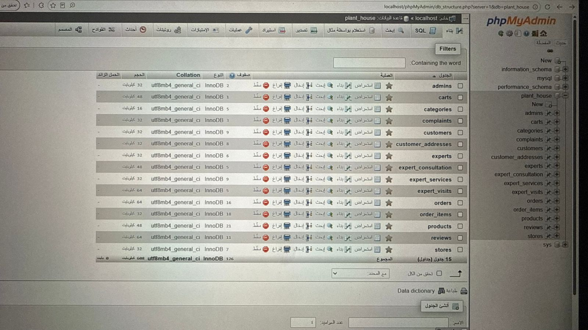

# 🌱 Plant House

## AI-Powered Smart Plant Platform

Plant House is a graduation project developed as part of the Bachelor of Information Systems program at Najran University.

The platform connects plant lovers, plant stores, and agricultural experts through one integrated web application. It includes an online marketplace, expert consultations, order management, complaints management, and AI-powered plant analysis using Google Gemini.

---

## 🚀 Features

- User Registration & Login
- Plant Marketplace
- Shopping Cart
- Order Management
- Expert Consultation
- AI Plant Analysis using Google Gemini
- Complaints Management
- Email Notifications
- Admin Dashboard

---

## 🛠 Technologies

- PHP
- MySQL
- HTML
- CSS
- JavaScript
- Bootstrap
- Google Gemini API
- PHPMailer

---

## 👩‍💻 My Contribution

- Connected front-end interfaces with the back-end system.
- Integrated Google Gemini AI for plant image analysis.
- Connected the application with the database.
- Tested data flow across different system components.

---

## 🎓 Project Information

**Project Type:** Graduation Project

**University:** Najran University

**Major:** Information Systems

**Year:** 2026
## 📸 Project Screenshots

### AI Plant Analysis

### Products

### Agricultural Experts

### Home Page

### Database
 
## 📦 Source Code

The complete source code of this graduation project is available as a compressed archive in this repository.

**Current version:** Uploaded as a `.rar` archive.

> **Note:** The source code is temporarily provided as a compressed archive. Once the original project files are available, the repository will be updated with the extracted source code for easier browsing.
